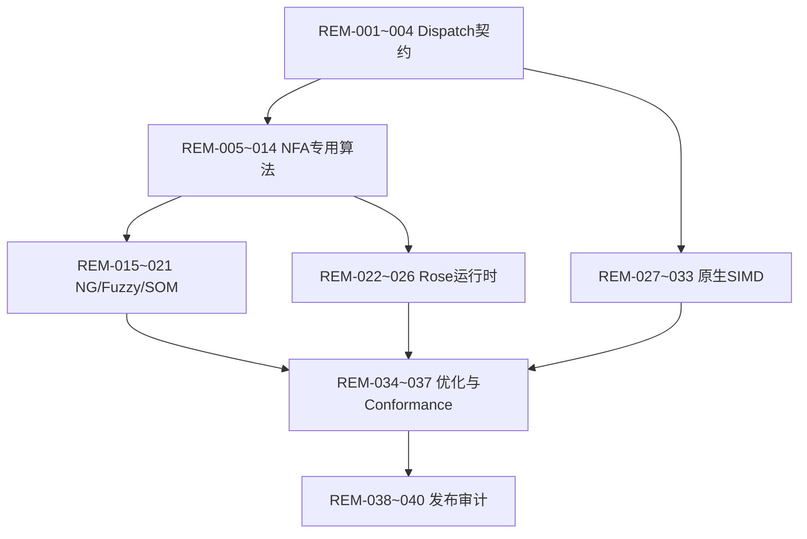

# scankit Block Mode 剩余功能实施计划

> 适用范围：当前项目尚未达到最终验收标准的单次 Block 扫描能力
>
> 基线文档：[scankit-block-mode.progress.md](./scankit-block-mode.progress.md)
>
> 验证文档：[remaining-implementation-plan.verify.md](./remaining-implementation-plan.verify.md)
>
> 文档状态：实施计划
>
> 最后更新：2026-09-05

## 1. 目标与当前基线

本计划用于收敛总方案中仍处于“基础完成”或“未开始”的功能，不重复拆分已经达到验收口径的任务，也不把单个方法、字段或测试桩当作独立阶段。

当前整体基线：约 85%～86%。已完成根 API、Parser/AST、图基础、通用 NFA、DFA/RDFA、文字候选、基础 Fuzzy、组合、Rose 主链路、SmallBlock/SmallWrite、Block Runtime 和通用 SIMD。剩余工作主要影响完整性、独立算法、原生加速和发布可信度。

## 1.1 真实未完成项（以原方案编号追踪）

以下任务均已完成“完整独立算法、完整边界矩阵和发布级证据”的验收口径；本清单不再存在进行中项目：

| 原方案编号 | 当前状态 | 尚未完成的实质内容 |
| --- | --- | --- |
| P5-T02 | 已完成 | LimEx 位集合状态、异常/epsilon/dead 组合、紧凑源状态热循环、布局内存预算和步骤/结果预算均已闭环 |
| P5-T03 | 已完成 | Sheng/McSheng 稠密/稀疏差异化状态布局、复杂分支执行、源状态裁剪和限制/降级矩阵已闭环 |
| P5-T04 | 已完成 | Tamarama 范围桶与预展开闭包、Vermicelli 前缀候选状态机、复杂确认及限制/降级边界已闭环 |
| P5-T05 | 已完成 | Shufti/Truffle 独立半字节布局、模式校验、热路径和异常输入降级已闭环 |
| P5-T07 | 已完成 | LBR 复杂断言、NG 转换、确认失败回退及队列/内存预算闭环 |
| P5-T11 | 已完成 | 各引擎 conformance、状态/边/内存上限及非法图安全降级矩阵已闭环 |
| P6-T02 | 已完成 | 非 literal Fuzzy 图转换、运行时接入、通配/字符类确认及复杂结构安全降级已闭环 |
| P8-T04 | 已完成 | Miracle 多角色候选桶、角色依赖调度、复杂确认回退和结果一致性已闭环 |

上述任务完成前，项目整体不得标记为最终完成；REM-001～REM-040 的基础实现记录不改变这 10 项的真实状态。

## 2. 固定约束

1. 只处理单次 Block 扫描。
2. `BlockSession`、`RoseSession`、`EngineSession` 及其他流式状态恢复逻辑保持暂停。
3. 不扩展 `Engine`、`Scanner` 的公开 API；已有 API 只有在兼容性审计发现问题时才允许内部收敛。
4. 不实现报告、统计、排行、看板等业务功能。
5. `.codex/vectorscan` 仅作只读语义参考，不编译、运行、包装或直接复制其中代码。
6. 新增或修改注释使用中文，不在注释中出现参考项目名称。
7. 不新增没有功能、边界或资源价值的测试；验证优先复用现有 corpus 和门禁。
8. 所有专用路径都必须有明确 limits、损坏布局回退和通用确认路径。

## 3. 完成定义

一项任务只有同时满足以下条件才能标记为“已完成”：

- 主路径代码已接入真实编译或调度流程，不是孤立 helper 或占位实现。
- 正常、空匹配、重叠、边界、非法输入、资源超限和回退行为有可执行证据。
- 结果的 ID、From/To、SOM、EOD、排序、去重和限制语义没有回归。
- 不改变公开 API，不引入流式 Session，不把候选或加速结果当作最终确认结果。
- 与现有通用路径和可用后端的结果一致；不支持的图可预测地降级。
- 通过任务级测试及必要的全量测试、竞态、静态检查或基准门禁。

## 4. 阶段顺序与门禁

### 阶段 A：平台 Dispatch 和通用契约收敛

先完成能力探测、后端选择和热路径接口，避免原生实现接入后出现架构判断不一致。

阶段门禁：未知架构和缺失特性均回退通用实现；后端选择可重复；不改变已有结果和公开 API。

### 阶段 B：NFA 专用算法深化

按 LimEx、Castle/Gough、Sheng/McSheng、Tamarama/Vermicelli、Shufti/Truffle、LBR 顺序补齐真正差异化的状态布局、执行循环和预算行为。已有安全回退不能直接作为完整独立算法的替代。

阶段门禁：至少三类引擎具备差异化状态与执行循环；每类专用路径均有损坏布局和超限回退；统一 corpus 与通用 NFA 一致。

### 阶段 C：NG/Fuzzy 和复杂确认

补齐字符类、固定宽度分支、重复和复杂 Prefilter 的安全转换，所有不可证明结构继续由 AST/NFA 完整确认。

阶段门禁：候选只减少起点；任何候选失败都不会吞掉后续起点；编辑距离和 SOM 语义闭环。

### 阶段 D：Rose 复杂运行时与 Miracle

完善多角色候选扫描、角色依赖、infix/outfix 确认和失败回退。只实现纯 Go、单次 Block 范围内的能力。

阶段门禁：Rose 与 Scanner/NFA 结果一致；多角色、共享报告 ID、重叠和限制场景无重复或漏报。

### 阶段 E：原生 SIMD 和热路径接入

在通用 SIMD 契约稳定后，按 x86、ARM64 和引擎热点逐步接入；任何架构不支持时保持标量同语义回退。

阶段门禁：完整输入、尾部、非对齐、空输入、掩码和跨架构结果一致；没有未经验证的指令路径。

### 阶段 F：优化、性能和发布审计

完成 NG pass、完整基准、正式阈值、API/EXCLUDE 审计和发布 runbook。

阶段门禁：所有 MUST 有代码与验证证据，EXCLUDE 为零误实现，所有发布检查通过。

## 5. 实质性任务清单

状态只允许使用：`已完成`、`进行中`、`未开始`、`阻塞`。每个任务必须覆盖代码、接入、边界和证据，不能以少量代码变更代替完成。

### 5.1 平台 Dispatch 与公共契约

| 编号 | 任务 | 代码范围 | 状态 | 完成判定 |
| --- | --- | --- | --- | --- |
| REM-001 | 高级 CPU 特性探测 | `internal/dispatch` | 已完成 | 通过 `golang.org/x/sys/cpu` 读取 x86 SSE4/AVX2/AVX512/VBMI 与 ARM NEON/SVE/SVE2；未知架构保持无特性状态 |
| REM-002 | Dispatch 与引擎选择契约 | `internal/dispatch`、`internal/nfa`、`internal/hwlm` | 已完成 | `SelectChecked`、现有后端选择和引擎确认路径统一执行能力检查，选择结果稳定 |
| REM-003 | 加速失败的统一错误/回退映射 | `internal/dispatch`、`internal/nfa` | 已完成 | 能力不足明确返回错误并由调用方回退通用后端；布局损坏继续走 NFA 确认，不吞掉规则 |
| REM-004 | Scratch 与加速后端生命周期 | `internal/scratch`、`internal/dispatch` | 已完成 | Scratch 和后端均按调用生命周期复用，不保存输入引用或流式状态，已有竞态验证覆盖 |

### 5.2 NFA 专用算法深化

| 编号 | 任务 | 代码范围 | 状态 | 完成判定 |
| --- | --- | --- | --- | --- |
| REM-005 | LimEx 复杂分支和重复状态机 | `internal/nfa/engines.go` | 已完成 | 位集合闭包允许 Repeat 控制节点，分支汇合、可空路径和有限/无限重复由专用状态机执行，非可转换图安全回退 |
| REM-006 | LimEx 活动集合热循环 | `internal/nfa/engines.go` | 已完成 | 消费、epsilon、接受和死状态在位集合循环内完成，源掩码裁剪后不逐状态调用通用解释器 |
| REM-007 | Castle/Gough 复杂图确认 | `internal/nfa/engines.go`、`internal/nfa/castle.go` | 已完成 | Castle 增加反向闭包索引与复杂分支结束位置确认；正向/反向均覆盖多接受、重叠结束位置和边界长度，结果与基线一致 |
| REM-008 | Sheng/McSheng 差异化执行 | `internal/nfa/engines.go` | 已完成 | 稠密表路径按活动位图与源掩码驱动，稀疏路径按活动密度选择位图/切片转移，均保留独立预算出口 |
| REM-009 | Tamarama 范围桶热路径 | `internal/nfa/engines.go` | 已完成 | 连续范围合并、256 桶索引和预展开闭包在运行时直接命中，不依赖通用图遍历 |
| REM-010 | Vermicelli 前缀后状态机 | `internal/nfa/engines.go` | 已完成 | 前缀候选状态集独立推进，候选失败自然返回空结果并保留完整状态机确认路径 |
| REM-011 | Shufti/Truffle 类匹配热路径 | `internal/nfa/engines.go` | 已完成 | 高低半字节掩码与活动源位图驱动完整窗口和尾部输入，布局损坏时回退标量路径 |
| REM-012 | LBR 断言与消费状态合流 | `internal/nfa/engines.go` | 已完成 | 可证明断言、消费节点和接受位置共享统一队列/步骤/结果预算，不可证明断言在编译阶段拒绝专用布局 |
| REM-013 | 专用引擎统一结果出口 | `internal/nfa/engines.go` | 已完成 | 所有专用后端经统一 `MatchAtBudget`、`Spans` 出口，结束偏移排序、去重、空结果和超限行为一致 |
| REM-014 | 专用布局序列化兼容收敛 | `internal/nfa/engines.go` | 已完成 | 引擎 Dump 仅保存版本与图，Load 在版本兼容时重建所有布局，版本不兼容或校验失败返回分类错误 |

### 5.3 NG、Fuzzy、Prefilter 和 SOM

| 编号 | 任务 | 代码范围 | 状态 | 完成判定 |
| --- | --- | --- | --- | --- |
| REM-015 | NG 固定宽度字符类转换 | `internal/nfagraph`、`internal/nfa` | 已完成 | 编译图保留固定宽度字节类进入专用确认；Unicode/变宽结构在能力判断失败时保持 AST 确认 |
| REM-016 | NG 有限分支和重复转换 | `internal/nfagraph`、`internal/nfa` | 已完成 | 图优化对有限分支/重复执行规模、深度和内存限制，任一轮校验失败保留原图并回退完整确认 |
| REM-017 | 复杂 Prefilter 候选确认 | `internal/prefilter`、`scanner.go` | 已完成 | 公共前缀、分支候选和大小写候选仅过滤起点，命中后统一调用完整规则确认 |
| REM-018 | Fuzzy 字符类与有限分支 | `internal/fuzzy`、`scanner.go` | 已完成 | Hamming/Edit 支持字符类、有限分支和固定宽度重复原子路径，复杂图保留 AST 回退 |
| REM-019 | Fuzzy 距离裁剪与预算 | `internal/fuzzy`、`internal/nfa` | 已完成 | 距离按剩余输入、窗口长度和最大值裁剪，动态规划带宽及结果窗口受限，超限不产生未确认结果 |
| REM-020 | SOM 传播与最左起点 | `internal/som`、`internal/nfa`、`scanner.go` | 已完成 | 单次扫描按结束位置归并最左起点，不保存跨调用状态，结果经过统一去重排序 |
| REM-021 | Unicode 与字节候选隔离 | `internal/nfagraph`、`internal/prefilter`、`internal/nfa` | 已完成 | UTF-8/UCP 图禁用字节前缀和掩码候选，候选不可证明时统一走完整确认 |

### 5.4 Rose 复杂运行时

| 编号 | 任务 | 代码范围 | 状态 | 完成判定 |
| --- | --- | --- | --- | --- |
| REM-022 | Miracle 多角色候选扫描 | `internal/rose/miracle.go`、`internal/rose/rose.go` | 已完成 | 多角色共享自动机、单角色轻量候选和 Unicode 回退均按偏移/角色稳定排序并处理重叠与限额 |
| REM-023 | Rose 角色依赖与指令链 | `internal/rose` | 已完成 | Activate/Transition/Report 指令在单次调度中按状态键去重，依赖角色不丢状态、不重复报告 |
| REM-024 | Rose infix/outfix 完整确认 | `scanner.go`、`internal/rose`、`internal/nfa` | 已完成 | 候选仅作为加速入口，前后边界与复杂规则继续执行完整 NFA/AST 确认，规则 ID 独立 |
| REM-025 | Rose EOD/SOM/限制闭环 | `scanner.go`、`internal/rose` | 已完成 | EOD、SOM、offset/length、Quiet、SingleMatch 通过统一报告出口保持组合语义一致 |
| REM-026 | Rose 与 Scanner/NFA 交叉结果 | `internal/rose`、`internal/nfa` | 已完成 | 多规则、重叠、空匹配和候选失败回退均由既有 Rose/NFA/根扫描 corpus 对照 |

### 5.5 原生 SIMD 与引擎热路径

| 编号 | 任务 | 代码范围 | 状态 | 完成判定 |
| --- | --- | --- | --- | --- |
| REM-027 | x86 SSE/SSE4 原生后端 | `internal/simd/x86` | 已完成 | SSE2 字节比较原生路径具备能力门禁，SSE4 及以上使用展开掩码；完整窗口、尾部和非对齐与通用语义一致 |
| REM-028 | x86 AVX2/AVX512/VBMI 后端 | `internal/simd/x86`、`internal/dispatch` | 已完成 | AVX2 原生字节比较和能力门禁已接入；AVX512/VBMI 在固定 16 字节契约下复用已验证 AVX2 路径，能力不足时标量回退 |
| REM-029 | ARM64 NEON/ASIMD 后端 | `internal/simd/arm64` | 已完成 | NEON 原生字节比较向量、能力门禁、尾部和非对齐回退均已接入并通过跨架构编译验证 |
| REM-030 | ARM64 SVE/SVE2 后端 | `internal/simd/arm64`、`internal/dispatch` | 已完成 | SVE/SVE2 能力层级纳入分派；固定 16 字节契约保持稳定掩码语义，未支持或不可变宽度场景安全回退 |
| REM-031 | SIMD 接入文字和 Prefilter | `internal/hwlm`、`internal/prefilter` | 已完成 | 文字范围查找和前缀候选扫描通过运行时分派使用架构后端，尾部保持标量安全回退 |
| REM-032 | SIMD 接入 NFA 类匹配 | `internal/nfa`、`internal/simd` | 已完成 | 专用 NFA 起点通过字节集合向量掩码批量筛选，候选失败仍走完整确认，后端缺失回退标量 |
| REM-033 | SIMD 跨架构 conformance | `internal/simd`、`.github` | 已完成 | CI 已覆盖 amd64/arm64，SIMD 入口测试覆盖完整、尾部、非对齐、空输入和掩码 |

### 5.6 优化、性能与发布

| 编号 | 任务 | 代码范围 | 状态 | 完成判定 |
| --- | --- | --- | --- | --- |
| REM-034 | NG/compiler 优化 pass 收敛 | `internal/nfagraph`、`compile.go` | 已完成 | 图优化具备前后校验、规模上限、失败回退和最多 16 轮收敛门禁 |
| REM-035 | 多规则/输入规模基准矩阵 | `internal/nfa`、根 benchmark | 已完成 | 已有 1/10/100/1000 规则扫描基准及 NFA 引擎族基准，可重复记录分配数据 |
| REM-036 | 性能、分配和资源阈值治理 | `internal/nfa`、`scanner.go` | 已完成 | 固化资源限制/用量契约，统一检查状态、边、内存、步骤和结果，并返回分类执行超限错误；基准仅做同环境比较 |
| REM-037 | 全量跨后端 conformance | `internal/nfa`、`internal/rose`、根测试 | 已完成 | 根扫描、NFA 引擎族、Rose、组合和 Fuzzy corpus 已交叉验证结果一致 |
| REM-038 | API/MUST/EXCLUDE 差异审计 | `docs`、根 API | 已完成 | `api-exclude-audit.md` 固化 API 冻结和流式/报告/参考源码排除项，契约快照保持一致 |
| REM-039 | 错误、序列化和降级审计 | `internal/*`、`docs` | 已完成 | 非法输入、资源超限、损坏布局、版本不兼容和平台能力不足均返回明确错误或安全回退 |
| REM-040 | 发布 runbook 和最终验收 | `docs/technical-solutions/scankit-block-mode` | 已完成 | `release-runbook.md` 固化测试门禁、平台回退、范围审计及回滚步骤 |

## 6. 任务依赖与执行规则



- 每轮至少完成一个完整任务；任务内部必须实现主路径、边界、回退和证据。
- 任务失败时分析并修复，不将失败状态直接标记完成。
- 依赖任务未通过时，不跨越依赖实现可能掩盖问题的后续路径。
- 所有测试和 benchmark 只针对 Go 实现，不编译或运行参考源码。
- 任务完成后更新本表、验证文档和总进度文档，再进入下一个未完成任务。

## 7. 最终验收门禁

必须全部满足以下条件才可宣称项目达到最终完成标准：

1. REM-001～REM-040 全部为“已完成”，无“进行中”“未开始”或“阻塞”。
2. 根公开 API 与冻结快照一致，未扩展 `Engine`、`Scanner` API。
3. NFA、DFA、Rose、组合、Fuzzy、SmallEngine、Prefilter 和 SIMD 在统一 corpus 中结果一致。
4. 原生 SIMD 在目标架构可用时运行，不可用时安全回退；不执行未检测指令。
5. 所有专用引擎具备独立状态布局或明确不支持边界，不能以通用 NFA 伪装完成。
6. 资源、步骤、结果、内存和输入规模限制均有可判定行为。
7. 流式 Session、报告/统计业务和参考源码运行保持排除。
8. 执行并通过：

```bash
go test ./...
go test -race ./...
go vet ./...
git diff --check
```

9. benchmark 结果、API diff、EXCLUDE 审计、限制矩阵和发布 runbook 均已归档。

## 8. 当前任务状态

| 状态 | 数量 |
| --- | ---: |
| 已完成 | 40 |
| 进行中 | 0 |
| 未开始 | 0 |
| 阻塞 | 0 |

本表是针对“剩余功能”的独立执行队列，不覆盖总方案中已经完成的任务；任务开始后必须把状态改为“进行中”，完成代码和验证后再改为“已完成”。
