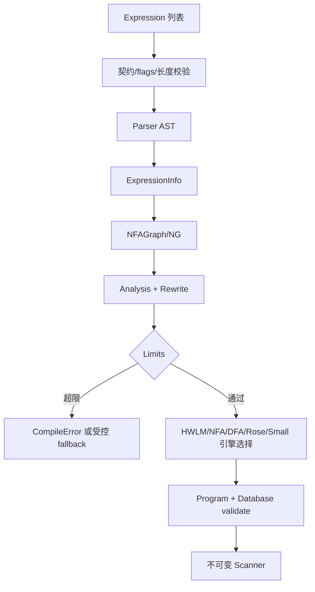

# scankit Vectorscan Block Mode 复刻实施任务方案

任务总清单及实时完成情况：[scankit-block-mode.progress.md](./scankit-block-mode.progress.md)

> 需求基线：`.codex/技术方案.md`（范围冻结版，2026-08-29）  
> 功能模块：`scankit-block-mode`  
> 文档状态：待评审  
> 范围：Go 后端库（Block Mode）  
> 最后更新：2026-08-29  
> 实施阻塞项：无（Q-001～Q-005 均已确认；`.codex/vectorscan` 仅作源码参考）  
> 技术栈：Go 1.27（公开 API 与实现）、标准库 `regexp/syntax` 仅可用于对照测试；自有 Parser/IR/Engine、`go:build` 架构分派、可选 Go assembly；测试使用 `testing`/fuzz/benchmark；仓库内 `.codex/vectorscan` 源码、头文件、现有测试和工具仅作实现参考，不编译/运行其代码，不做 Go 包装
> 实现验证：[`scankit-block-mode.verify.md`](./scankit-block-mode.verify.md)

## 1. 背景与目标

### 1.1 需求事实

- R-001：以 `scankit/dev` 当前公开 API（`Compile`、`New`、`Scanner.Scan/ScanInto`、`Engine.Replace/Mask`、`Expression/ExpressionExt`、`Match`）为不可变外部契约。
- R-002：完整复刻仓库内 `.codex/vectorscan`（固定源码快照）的 Block Mode 编译、引擎、运行时、优化、CPU dispatch 和 SIMD 语义。
- R-003：Block 输入仅为 `[]byte`；结果保持各执行后端产生的顺序，Scanner 不重新排序；保留 offset、SOM、EOD、重复抑制和回调语义，需要稳定顺序时由调用方负责排序。
- R-004：必须实现 Parser/AST、Compiler、NFAGraph/NG、Graph Infrastructure、HWLM（FDR/Teddy/Noodle）、全部列出的 NFA/DFA/Rose/Small 引擎、SOM、Prefilter、Fuzzy、Combination、Scratch、Report、Database、Dispatch/SIMD。
- R-005：必须覆盖空输入、空匹配、NUL、UTF-8/UCP、EOD、SOM、Offset 边界、编辑/汉明距离、SIMD 尾部/非对齐、重复匹配与顺序等边界。
- R-006：仅实现当前 Vectorscan 有效 Block 能力；Streaming、Vectored、Chimera、Power/VSX、历史 Sidecar 永久排除。
- R-007：允许内部包、类型、编译器、runtime、engine、SIMD backend 重构；不得改变公开类型和语义。

### 1.2 可观察验收目标

| 目标 | 可观察结果 | 需求依据 |
| --- | --- | --- |
| API 兼容 | 现有源码无需修改即可编译，公开类型/方法签名不变 | R-001、R-007 |
| 语义正确 | 与 `.codex/vectorscan` 源码行为的匹配 ID、From/To、SOM、顺序、重复抑制一致 | R-002、R-003、R-005 |
| 功能完整 | 需求范围冻结表中的每一项 MUST 均有代码、单测和 E2E/源码 conformance 证据 | R-004 |
| 可控资源 | 编译/运行受 limits 约束，超限可安全 bailout/fallback，无热路径临时分配 | R-002、R-004 |
| 平台覆盖 | x86-64（SSE/SSE4.x、AVX2、AVX512、AVX512VBMI）与 ARM64（NEON、SVE、SVE2、SVE2-BITPERM）均有检测、分派和 generic fallback | R-002 |
| 范围隔离 | 排除能力无 API、无运行时路径、无误实现；`[]byte` Block 扫描仍可用 | R-006 |

### 1.3 范围、事实源与问题

| 分类 | 内容 | 依据 |
| --- | --- | --- |
| 本期范围 | Phase 0–12 所有任务及其验证；Block Mode 单段 `[]byte` | R-002、R-004 |
| 非目标 | Streaming、Vectored、Chimera、Power/VSX、Sidecar；不恢复历史已移除 engine | R-006 |
| 事实源/唯一写入方 | `Scanner` 持有不可变 `database.Program`；扫描上下文来自 `scratch` pool；Match 由统一 `report.Manager` 产生 | R-001、R-003 |
| 跨模块契约 | `Expression → parser.AST → compiler.ExpressionInfo → nfagraph.Graph → engine.Program → runtime → report → Match` | R-002、R-004 |

| 问题编号 | 问题 | 影响 | 等级 | 状态 | 建议澄清 |
| --- | --- | --- | --- | --- | --- |
| Q-001 | `CompileFlag`、`ExpressionExtFlag` 的数值及每个 flag 语义未在仓库公开 | Parser、边界、API 契约 | P1 | 已确认 | 按目标 Vectorscan 版本逐项对齐常量值、位布局、语义和组合规则；不得自行重新编号；在 P0-T02 固化映射与兼容测试 |
| Q-002 | Vectorscan 参考源码及允许的语义差异未固定 | 行为实现与完成判定 | P1 | 已确认 | 唯一参考为仓库内 `.codex/vectorscan` commit `4724cff398f81818b28b373ff67c41b9ed95d317`；仅阅读源码、头文件和测试，不编译、运行或包装；未经批准的语义差异为 0 |
| Q-003 | Vectorscan 的数据范围/错误约束、编译资源 limits、性能口径未定义 | 资源控制、性能验收、错误兼容 | P1 | 已确认 | 完全遵循 `.codex/vectorscan` 源码快照的可接受范围、bailout 和错误行为；不新增项目级硬限制；Go benchmark 仅记录同一目标场景的吞吐、P95、内存和 alloc/op，不设额外绝对阈值 |
| Q-004 | 字符串 Pattern 的最大长度未定义 | `Expression.Pattern` 校验和内存上限 | P1 | 已确认 | 不另设 Pattern 长度常量；遵循 `.codex/vectorscan` parser/compiler 的可接受范围及其资源错误行为 |
| Q-005 | UTF-8/UCP、Lookbehind 支持子集、Combination 输入形态未明确 | Parser/Engine 能力边界 | P1 | 已确认 | 严格以 `.codex/vectorscan` 当前源码支持矩阵、解析器校验和 runtime 行为为准，逐项固化 fixture；不引入源码未支持的扩展语义 |

### 1.4 技术实现建议

| 编号 | 场景 | 风险 | 措施 | 影响 | 配置/阈值 | 替代方案 | 关联 F/U/V | 关联问题 | 验证 | 决策与依据 |
| --- | --- | --- | --- | --- | --- | --- | --- | --- | --- | --- |
| S-001 | 编译昂贵、规则复用 | 重复编译、峰值内存 | `database.Program` 不可变；按表达式指纹缓存仅在调用方显式启用时使用 | 降低编译延迟 | 遵循 `.codex/vectorscan`；不新增硬阈值 | 不缓存 | F-01/U-01/V-001 | Q-003 | 编译基准与哈希一致性 | 采纳；不改变 Vectorscan 可接受范围 |
| S-002 | 高吞吐扫描 | 热路径分配导致尾延迟 | 每 Scanner context 从 `scratch` pool 借用，engine 分区复用；禁止热路径 `make/new` | 内存可预测 | 目标 0 alloc/op | 每次新建 context | F-02/U-02/V-020 | 无 | `AllocsPerRun`、pprof | 采纳；R-004 明确要求 |
| S-003 | 多规则/热点 literal | 全量 NFA 扫描成本高 | HWLM + FDR/Teddy/Noodle，长 literal 必须 confirmation；热点 key 不使用无限集合 | 降低 CPU | literal 长度/集合上限遵循 `.codex/vectorscan` | 仅 NFA | F-03/U-03/V-010 | Q-003 | engine selection 与性能压测 | 采纳；R-004 |
| S-004 | 跨 engine 副作用 | 状态不一致、重复报告 | 统一 `report.Manager`、业务 rule ID 去重、稳定排序；engine 只提交候选 | 保持语义 | 无 | 各 engine 自报 | F-02/U-02/V-011 | 无 | 源码 fixture 对照 | 采纳；R-003 |
| S-005 | 编译状态爆炸 | OOM/不可用数据库 | 对齐 `.codex/vectorscan` 的 bailout/状态限制；超限记录原因并按源码语义 fallback 或报错 | 可能选择较慢 engine | 以源码快照为准 | 无限制 | F-01/U-01/V-003 | Q-003 | 超限 fixture | 采纳；R-004 |
| S-006 | 源码语义/平台差异 | 测试不可重复 | 固定 `.codex/vectorscan` commit、引用其现有测试与工具、输入 seed；差异分类为实现 bug，只有经评审批准的 Q 才能例外 | 测试成本增加 | `go test`/`go run`；不引入 Oracle、wrapper 或 Docker | 手工比对 | U-01/U-02/V-030 | Q-002 | Go 测试与源码 fixture | 采纳；直接参考固定源码 |
| S-007 | SIMD 不可用/不安全尾部 | 崩溃或结果错误 | Generic/SIMDe 语义基线；CPU feature 检测、safe/partial/unaligned load、tail 处理 | 跨平台一致 | 无 | 仅 generic | U-02/V-021 | 无 | feature matrix/fuzz | 采纳；R-005 |
| S-008 | 编译错误与敏感输入 | Pattern 泄露、错误不可诊断 | CompileError 分类、位置/原因脱敏；pattern 不写日志 | 可观测性受限 | 无 | 输出原文 | F-01/U-01/V-002 | 无 | 错误断言与日志扫描 | 采纳 |

### 1.5 Vectorscan 约束与项目阈值边界

仓库内 `.codex/vectorscan` 可作为语义基线的约束包括：`hs_expr_info_t.min_width/max_width` 使用无符号 32 位宽度（无界最大宽度为 `UINT_MAX`）；扩展参数的 `min_offset`、`max_offset`、`min_length` 使用无符号 64 位；Edit/Hamming distance 使用无符号整数；扩展字段由 `HS_EXT_FLAG_*` 位标识；编译失败通过 `hs_compile_error_t`（错误消息和表达式索引）返回；目标 CPU 通过 `hs_platform_info_t` 提供 feature/tune 信息。具体常量、错误码和支持矩阵必须直接从 `.codex/vectorscan` 头文件/源码导出并在 P0-T02 锁定。

`.codex/vectorscan` 并未在公开 API 中规定统一的吞吐、P95 或 alloc/op 阈值；实现时遵循该源码快照已有的 bailout/状态限制，不新增项目级硬限制。性能通过 Go benchmark 在固定 corpus 下记录，不将项目指标误称为“Vectorscan 官方阈值”。

### 1.6 Vectorscan 源码参考边界

本项目不编译或运行 Vectorscan，不实现 Oracle、wrapper，也不使用 Go 包装其代码。实现和测试仅阅读固定源码 `.codex/vectorscan` commit `4724cff398f81818b28b373ff67c41b9ed95d317`、其头文件、现有单元测试和工具，并据此编写独立 Go 实现与 fixture。

| 参考方式 | 具体要求 |
| --- | --- |
| 源码 | 直接阅读 `.codex/vectorscan` 的 Block compiler/runtime、头文件、unit/tools，记录 commit |
| 测试 | Go 侧按源码行为编写 fixture、单元、fuzz、benchmark；不执行 Vectorscan 工具 |
| 范围 | 只实现方案规定的 Block 能力；不因源码中存在其他目录而扩大范围 |

不引入 Oracle、wrapper、Docker 或 CGo 运行时依赖；P0-T03 完成源码能力清单、引用索引和 Go fixture 建立。

## 2. 目标架构与目录

保持根目录公开文件不变，新增内部包（可合并文件但不得删能力）：

```text
internal/{compiler,parser,nfagraph,graph,hwlm,fdr,rose,nfa,dfa,smallwrite,smallblock,
 som,prefilter,fuzzy,combination,runtime,scratch,report,database,dispatch,simd,util}
```

依赖方向必须单向：`parser → nfagraph → compiler → engine packages → database → runtime/report`；`simd/dispatch` 不依赖业务层；禁止 engine 互相循环依赖。所有跨阶段对象定义版本和校验函数。

## 3. AI Coding 任务拆分

执行规则：每个任务独立 PR/提交；先写失败测试再实现；任务完成必须更新对应 `V-xxx` 证据。除 Phase 0 外不得改公开 API。依赖任务全部通过后才能开始。

### Phase 0 — Contract Freeze

| 任务 | 工作内容 | 依赖 | 交付物 | 验收 |
| --- | --- | --- | --- | --- |
| P0-T01 | 导出 API/语义快照：签名、Match 排序、Replace/Mask 重叠规则、offset 单位 | 无 | `internal/contract`、快照测试 | `go test ./...`；快照变更需人工批准 |
| P0-T02 | 从目标 Vectorscan 头文件/公开 API 导出并固化 `CompileFlag`、`ExpressionExtFlag` 的常量值、位布局、语义和组合规则；同时固化 ExpressionExt、错误模型和 Pattern 长度策略；登记 Q-002~Q-005 | P0-T01 | `contract.md`、flags 映射表、CompileError 枚举 | flags 与 Vectorscan 逐项数值对齐；兼容测试通过；其余未确认项以错误/待确认标记，不猜测 |
| P0-T03 | 基于 `.codex/vectorscan` commit `4724cff398f81818b28b373ff67c41b9ed95d317` 建立源码能力清单、Go fixture 和引用索引 | P0-T01、P0-T02 | `testdata/corpus`、源码映射文档 | 使用 `go test`/`go run` 执行 Go 测试；记录源码 commit；不引入 Oracle、wrapper、Docker 或 CGo |

### Phase 1 — Infrastructure

| 任务 | 工作内容 | 依赖 | 交付物 | 验收 |
| --- | --- | --- | --- | --- |
| P1-T01 | Graph：有/无向图、Vertex/Edge 属性、DFS/BFS、SCC、可达性、子图/range、压缩、rewrite | P0 | `internal/graph` | 随机图性质测试、SCC/dominator fixture |
| P1-T02 | Bitset、CharReach、容器、Queue/PriorityQueue、内存 helper | P0 | `internal/util` | 边界/NUL/空集合测试；基准无异常分配 |
| P1-T03 | CompileContext、CompileError、CompileLimits、PlatformCapabilities | P0 | `internal/compiler/context.go` | 超限/取消/错误位置测试；Q-003 由配置注入 |
| P1-T04 | SIMD 抽象 Generic：load/partial/safe/unaligned、store、compare/mask/shift/shuffle/permute/bit/popcount、tail | P1-T02 | `internal/simd/generic` | 与标量参考逐字节一致；非对齐和短输入 fuzz |
| P1-T05 | CPU detection、backend registry、fat-runtime fallback（x86/ARM64） | P1-T04 | `internal/dispatch` | 模拟 feature mask，确保无特性机器走 generic |

### Phase 2 — Parser / AST

| 任务 | 工作内容 | 依赖 | 交付物 | 验收 |
| --- | --- | --- | --- | --- |
| P2-T01 | Lexer/Parser/AST/Component：literal、class、range、sequence、alternation、repeat | P1 | `internal/parser` | 语法树 golden、错误位置 |
| P2-T02 | assertion/boundary/word-boundary/EOD/lookahead/lookbehind（严格按 `.codex/vectorscan` 支持子集） | P2-T01 | AST 节点与 validation | 正负 fixture；源码未支持形式必须显式失败 |
| P2-T03 | atomic group、backreference、conditional reference、control verbs、UTF-8/UCP | P2-T01 | 节点、引用表、Unicode 属性 | 引用/编码边界测试 |
| P2-T04 | logical AND/OR/NOT 解析与组合输入模型 | P2-T01 | `internal/combination/parser.go` | 组合语法和非法组合测试 |
| P2-T05 | parser/reference/semantic validation（长度、空表达式、冲突 flags） | P2-T01~T04 | validation report | 每个 CompileError 可定位且不泄露 pattern |
| P2-T06 | Parser conformance harness | P2-T01~T05、P0-T03 | parser corpus/fuzz | 按 `.codex/vectorscan` 源码与测试定义的支持范围验证 AST/接受集 |

### Phase 3 — NFAGraph / NG

| 任务 | 工作内容 | 依赖 | 交付物 | 验收 |
| --- | --- | --- | --- | --- |
| P3-T01 | NFAGraph、Node/Edge/Component、Literal/Assertion/Report/Repeat 节点、Builder | P2 | `internal/nfagraph` | 图结构 golden、可达性 |
| P3-T02 | SOM、LBR、Prefilter、UTF-8 元数据及 ExpressionInfo | P3-T01 | info/metadata | 元数据与 AST 一致 |
| P3-T03 | depth/dominator/region/equivalence/redundancy analysis | P3-T01 | analysis passes | 性质测试和复杂度上限 |
| P3-T04 | pruning/restructuring/split/squash/stop、前后向 acceleration、engine-specific transforms | P3-T01~T03 | rewrite passes | 每 pass 与源码定义的语义等价 |
| P3-T05 | NG dump/validate/version | P3-T01~T04 | debug representation | 非法图被拒绝，版本可读 |

### Phase 4 — Literal / HWLM

| 任务 | 工作内容 | 依赖 | 交付物 | 验收 |
| --- | --- | --- | --- | --- |
| P4-T01 | Literal management/analysis/acceleration/candidate confirmation | P3 | `internal/hwlm` | 短/长/NUL literal 候选不漏报 |
| P4-T02 | FDR matcher | P4-T01、P1 SIMD | `internal/fdr` | 多 literal、重叠、尾部测试 |
| P4-T03 | Teddy matcher | P4-T01、P1 SIMD | `internal/hwlm/teddy` | lane/mask 与标量一致 |
| P4-T04 | Noodle matcher 与 matcher selection | P4-T01 | `internal/hwlm/noodle` | selection fixture、fallback |
| P4-T05 | Long literal confirmation 接入 NG/Rose | P4-T01~T04 | confirmation path | 候选误报被过滤、真报保留 |

### Phase 5 — NFA / DFA engines

每个 engine 均需 `compiler`、`runtime`、`state/queue`、`report`、`limits`；适用时实现 acceleration 和 SIMD backend。公共接口建议 `Compile(graph, ctx) (Program,error)`、`Run(program,scratch,input,report)`。

| 任务 | 引擎/内容 | 依赖 |
| --- | --- | --- |
| P5-T01 | Castle、Gough | P3、P4 |
| P5-T02 | LimEx（独立 state/context/exceptional/shuffle/64-bit/native/SIMD，禁止降级为普通 NFA） | P5-T01 |
| P5-T03 | McClellan、Sheng、McSheng | P5-T01、P5-T02 |
| P5-T04 | Tamarama、Vermicelli | P5-T01 |
| P5-T05 | Shufti、Truffle | P4、P1 SIMD |
| P5-T06 | Repeat、MPV（含 acceleration/state/report；不恢复历史 Sidecar） | P3 |
| P5-T07 | LBR compiler/runtime/state/acceleration/report/SIMD，完成 NG→LBR | P3、P5-T06 |
| P5-T08 | DFA construction/determinisation/state generation/minimization/compression/runtime/acceleration/resource limits | P3 |
| P5-T09 | RDFA/reverse DFA 与前向/反向边界 | P5-T08 |
| P5-T10 | Engine selection（literal/NFA/DFA/LimEx/LBR/Repeat）和 fallback | P4、P5-T01~T09 |
| P5-T11 | 每引擎 compiler/runtime conformance 与状态上限测试 | P5-T01~T10 |

Engine selection 最低覆盖矩阵（允许实现选择不同但语义必须一致）：

| Pattern/场景 | 首选路径 | 失败/超限处理 |
| --- | --- | --- |
| Literal-heavy | HWLM/FDR/Teddy/Noodle | 回退可验证 NFA |
| Simple NFA | Castle/Gough | LimEx 或通用 fallback |
| Complex NFA | LimEx | 受限 NFA，不得静默跳过 |
| Large DFA-friendly | McClellan/DFA/RDFA | 受限 NFA/Rose fallback |
| Rose-compatible | Rose | SmallBlock/SmallWrite 或通用 engine |
| Small input | SmallWrite/SmallBlock | 完整 Block runtime |

### Phase 6 — SOM / Fuzzy / Prefilter / Assertions

| 任务 | 工作内容 | 依赖 |
| --- | --- | --- |
| P6-T01 | Block SOM slot manager/operation/analysis/tracking/propagation/report/runtime（不实现 stream SOM） | P5 |
| P6-T02 | EditDistance/HammingDistance 编译、距离约束、fuzzy graph transform/runtime/engine integration | P3、P5 |
| P6-T03 | Prefilter generation/optimization/integration/runtime（literal + graph） | P4、P5 |
| P6-T04 | Lookaround/assertion/boundary/EOD propagation、compile/runtime | P2、P3、P5 |
| P6-T05 | AND/OR/NOT combination graph/compiler/runtime/report semantics | P2、P3、P5 |
| P6-T06 | 跨能力 conformance（SOM/fuzzy/prefilter/assertion/combination） | P6-T01~T05 |

### Phase 7 — Rose Compiler

| 任务 | 工作内容 | 依赖 |
| --- | --- | --- |
| P7-T01 | Rose Graph/Builder/Role creation/aliasing、width analysis、groups/merge/scatter | P3~P6 |
| P7-T02 | matcher generation/conversion：anchored/floating/literal/small/long/infix/outfix/EOD/lookaround/pure literal/single outfix/full rose | P4、P6、P7-T01 |
| P7-T03 | infix/outfix、literal acceleration、long literal confirmation、engine blob、anchored handling | P7-T02 |
| P7-T04 | Rose Program/instruction generation、validate/dump/version | P7-T01~T03 |
| P7-T05 | Rose compiler conformance 与 engine selection 断言 | P7-T04 |

### Phase 8 — Rose Runtime

| 任务 | 工作内容 | 依赖 |
| --- | --- | --- |
| P8-T01 | Program/Matcher/Queue/State 基础 runtime | P7 |
| P8-T02 | Scheduler：activation、scheduling、queue、transition、infix/outfix/catchup/report、duplicate suppression、ordering | P8-T01 |
| P8-T03 | Catchup scanning/literal/state/report 及与 matcher scheduling 交互 | P8-T02 |
| P8-T04 | Miracle literal/scanning/acceleration/state 与 Rose 集成 | P8-T02 |
| P8-T05 | Rose report/SOM/EOD/lookaround/infix/outfix 全路径 | P8-T01~T04、P6 |
| P8-T06 | Rose runtime conformance、乱序/重复/边界测试 | P8-T05 |

### Phase 9 — Small Engines

| 任务 | 工作内容 | 依赖 | 验收 |
| --- | --- | --- | --- |
| P9-T01 | SmallBlock detection/compile/runtime/report 与 Block runtime 集成 | P5、P8 | 小输入路径与完整路径结果一致 |
| P9-T02 | SmallWrite eligibility、IR、Build/compiler/runtime/report/dump-debug | P3、P9-T01 | NG→SmallWrite→Block→Report 完整链路；不得以普通 DFA 替代 |
| P9-T03 | SmallWrite/SmallBlock selection 与 fallback conformance | P9-T01~T02 | 选择变化不改变语义 |

### Phase 10 — SIMD / Dispatch 完整实现

| 任务 | 工作内容 | 依赖 |
| --- | --- | --- |
| P10-T01 | x86 SSE/SSE4.x、AVX2、AVX512、AVX512VBMI native backend | P1、P5 |
| P10-T02 | ARM64 NEON/ASIMD、SVE、SVE2、SVE2-BITPERM native backend | P1、P5 |
| P10-T03 | SuperVector、portable SIMDe semantics（只覆盖本项目所需操作） | P1、P10-T01~T02 |
| P10-T04 | feature detection/runtime dispatch/fat runtime/backend fallback 接入所有 engine | P10-T01~T03 |
| P10-T05 | SIMD conformance、safe tail、unaligned、vector boundary、跨架构 CI | P10-T04 |

### Phase 11 — Block Runtime / Scratch / Report / Database

| 任务 | 工作内容 | 依赖 |
| --- | --- | --- |
| P11-T01 | 统一 Scratch（Rose/NFA/DFA/queue/report/temp/engine 分区），pool 生命周期和 zero-allocation 热路径 | P5、P8、P9、P10 |
| P11-T02 | 统一 Report Manager：ID、offset、SOM、ordering、dedup、SINGLEMATCH、QUIET、callback | P6、P8、P11-T01 |
| P11-T03 | Database/Program engine layout、validation、version、架构兼容、scratch requirements | P5、P7~P10 |
| P11-T04 | Block runtime engine dispatch、program execution、offset/EOD/SOM、transition/fallback | P11-T01~T03 |
| P11-T05 | 根公开 API 接入：`Compile`、`Scanner.Scan/ScanInto`、`New`、Replace/Mask；并发安全 | P11-T04、P0 |
| P11-T06 | 全量 API/E2E/conformance、go vet/race、错误和资源恢复 | P11-T05 |

### Phase 12 — 全量优化与发布门禁

| 任务 | 工作内容 | 依赖 |
| --- | --- | --- |
| P12-T01 | 逐项迁移 NG/compiler optimization；每个 pass 保留语义回归 corpus | P3、P11 |
| P12-T02 | benchmark：1/10/100/1000 rules；short/medium/large；literal/regex/UTF8/SOM/fuzzy/Rose/NFA/DFA | P11 |
| P12-T03 | allocation、P95、吞吐、内存、编译规模与 Q-003 阈值核对；必要时降级策略 | P12-T02、Q-003 |
| P12-T04 | 范围审计：MUST=100%、EXCLUDE=0 accidental、public API diff=0、semantic regression=0 | 全部 |
| P12-T05 | 发布包：变更日志、参考源码 commit、平台矩阵、限制说明、回滚/降级 runbook | P12-T01~T04 |

## 4. 统一实现约束

### 4.1 数据与状态

- `database.Program`、各 engine program 均不可变；`Scanner` 可并发使用，scratch/context 不跨 goroutine 共享。
- 所有扫描均使用 `deleted` 不适用（内存对象）；任何状态表述必须在 program validation 中显式检查版本、架构和 scratch 大小。
- 业务规则 ID 使用 `uint32`，offset 使用 `uint64`；转换为切片索引前检查 `<= len(input)`，拒绝溢出。

### 4.2 SQL/持久化

本模块无数据库持久化；编译数据库为内存二进制对象。不得引入 SQL、锁或外部状态。若未来增加持久化，须另立模块方案并遵守表结构规则。

### 4.3 缓存、异步与限流

本库无内置网络/MQ；编译缓存只能显式 opt-in，key 为表达式/flags/ext 的稳定指纹，value 为不可变 Program，必须有容量/TTL 和失效策略（S-001）。扫描不使用 Redis/MQ；调用方负责并发限流。超限采用 CompileError 或 engine fallback，不静默跳过规则。

### 4.4 性能与安全

- Pattern、输入均视为不可信；限制深度、状态、program、内存和单次输入，禁止 panic/无限循环。
- 错误不得输出完整 Pattern；测试日志禁止记录敏感输入。
- 热路径禁止临时分配；使用 scratch、预分配结果切片、SIMD safe tail。所有优化须有 before/after benchmark 和源码 conformance 证据。

## 5. 关键流程

### 5.1 编译流程



### 5.2 Block 扫描流程

```mermaid
flowchart TD
 A[[]byte 输入] --> B[借用 Scratch]
 B --> C[Dispatch backend/program]
 C --> D[HWLM/engine 执行]
 D --> E[候选确认与状态转换]
 E --> F[Report Manager 去重/排序/SOM/EOD]
 F --> G[Scan/ScanInto 返回]
 G --> H[清理并归还 Scratch]
```

### 5.3 状态与异常

Program 状态：`Unvalidated → Validated → Executable`；校验失败不可执行。engine 超限/不支持时仅在编译期 fallback；运行期异常返回错误并清理 scratch，不复用脏状态。callback 错误立即停止并保证结果切片可预测。

## 6. API 任务契约

本模块是 Go 库而非 HTTP 服务，不存在 HTTP endpoint、header、分页或 Request-Id；HTTP API 模板不适用。下表用 F 编号追踪现有 Go 调用契约，签名和公开语义由 P0-T01 快照锁定。所有新增内部接口不得暴露到根包。

| 编号 | 接口 | 用途 |
| --- | --- | --- |
| F-01 | `scankit.Compile(expressions []Expression)` | 编译不可变 Scanner |
| F-02 | `(*Scanner).Scan(data []byte)` | 扫描并返回稳定匹配 |
| F-03 | `(*Scanner).ScanInto(data []byte, matches []Match)` | 复用结果切片扫描 |
| F-04 | `(*Engine).Replace(data []byte, fn ReplaceFunc)` | 按重叠优先级替换 |
| F-05 | `(*Engine).Mask(data []byte, fn MaskFunc)` | 原地定长脱敏 |
| F-06 | `scankit.New(expressions []Expression)` | 编译 Engine |

每个 F 项的参数校验、幂等（编译为纯函数；扫描不修改输入；Replace/Mask 遵守既有重叠规则）、错误、并发和限流均在 P0 快照及 P11-T05 实现；Pattern 最大长度引用 Q-004。

## 7. 后端实现用例总览

| 用例 | 触发源 | 类型 | 涉及组件 | 事务/幂等 | 缓存、异步与性能 |
| --- | --- | --- | --- | --- | --- |
| U-01 | F-01/F-06 | 编译 | parser→NG→engines→database | 纯函数；同输入同 Program | 可选指纹缓存；limits/fallback |
| U-02 | F-02/F-03 | 扫描 | runtime/scratch/dispatch/report | context 独占；输入只读 | 0 alloc 热路径；无异步 |
| U-03 | F-04/F-05 | 替换/脱敏 | report + replace | matches 原地排序；回调错误停止 | 复用 matches；无缓存 |
| U-04 | MQ/任务：不适用 | 消费者/定时任务 | 不适用 | 不引入外部副作用 | 不适用 |

### U-01 编译

```text
validate public contract and limits
parse all expressions (including references/combination)
build ExpressionInfo and NFAGraph
run analysis/rewrite passes
select and compile HWLM/NFA/DFA/Rose/Small engines
assemble immutable Program; validate version/arch/scratch
return Scanner or classified CompileError
```

### U-02 扫描

```text
validate input bounds; borrow scratch
dispatch selected backend
run engines and candidate confirmation
report.Manager applies offset/SOM/EOD/dedup/order/flags
append to caller slice; clear scratch; return
```

### U-03 替换/脱敏

保留现有 `resolveOverlappingMatches` 规则：按 From 升序、同起点 To 降序，选择不重叠片段；Replace 返回不与输入共享的新切片，Mask 只允许修改命中片段。

## 8. 验证门禁与追踪

每个任务至少包含：单元测试、集成测试、源码行为 conformance（适用时）、fuzz 边界、benchmark（性能任务）；验证编号统一见 [实现验证文档](./scankit-block-mode.verify.md)。P12-T04 前不得宣称完成。

| 需求 | 实现项 | 验证 |
| --- | --- | --- |
| R-001/R-007 | P0-T01、P11-T05 | V-001、V-002 |
| R-002/R-004 | P1~P11 全部任务 | V-010~V-028、V-030 |
| R-003/R-005 | P2、P6、P8、P11 | V-005、V-011~V-019、V-024 |
| R-006 | P12-T04 | V-029 |

## 9. 开发纪律与允许策略

以下行为直接阻断合并：跳过任一 MUST engine/优化、以普通 NFA/DFA 替代 LimEx/SmallWrite、推迟 Rose/SIMD、为方便而改变公开 API/Match/offset/Replace 语义、引入 Streaming/Vectored/Chimera/Power/VSX/Sidecar 路径、无 limits 地生成状态。允许先交付 Generic SIMD、正确 runtime 和基础 NG，再以保持源码 conformance 结果为前提增加 native backend、优化 pass 和性能改进；阶段性实现必须显式标记未完成任务。

## 10. 最终验收门禁

```text
Public API unchanged
  → Parser/AST
  → NG/Compiler
  → NFA + DFA + Rose
  → SmallWrite/SmallBlock
  → Runtime/Scratch/Report
  → Source-conformance tests
```

只有同时满足以下条件才可发布：

1. 范围冻结表中 MUST 功能代码、单元测试、集成测试和源码 conformance 证据齐全（100%）。
2. EXCLUDE 能力为 0 accidental implementation；代码、目录、API、dispatch 和文档均通过 V-029 审计。
3. `go vet ./...`、`go test ./...`、`go test -race ./...` 及平台矩阵通过；公开 API diff=0。
4. Go fixture 的 Match ID、From/To、SOM、EOD、顺序、重复抑制、回调和错误语义符合 `.codex/vectorscan` 源码定义；semantic regression=0。
5. Q-001～Q-005 均已关闭；性能、内存和分配结果已通过 Go benchmark 归档；限制、降级、恢复和参考源码 commit 已记录。

## 11. 输出完整性检查

| 检查项 | 结果 | 说明 |
| --- | --- | --- |
| 需求事实均有实现项与验证引用 | 是 | R-001~R-007 已映射 Phase 0~12 与 V-001~V-030 |
| MUST 能力均拆分 | 是 | Parser、NG、Graph、HWLM/FDR/Teddy/Noodle、全部 NFA/DFA/RDFA、LimEx/LBR/Repeat/MPV、SOM/Prefilter/Fuzzy/Combination、Rose 全链路、SmallBlock/SmallWrite、Runtime/Scratch/Report/Database、Dispatch/SIMD 均有任务 |
| EXCLUDE 明确且无误实现 | 是 | Streaming/Vectored/Chimera/Power/VSX/Sidecar 在范围、目录和审计任务中排除 |
| 技术建议有实现与验证 | 是 | S-001~S-008 关联 U/F/V |
| 数据库/SQL/异步/任务章节适用性 | 是 | 本模块无持久化、MQ、定时任务，已明确不适用 |
| P0/P1 问题已登记 | 是 | Q-001~Q-005；均已按 `.codex/vectorscan` 确认，无实施阻塞 |
| 模板占位符/失效链接 | 是 | 无占位符；验证链接为同目录有效文件 |

### 11.1 MUST 能力逐项映射

下表逐项对应原方案第 47 节范围冻结表；任何一项没有“任务 + 验证”均不得进入发布门禁。

| MUST 能力 | 实现任务 | 验证 |
| --- | --- | --- |
| Parser / Compiler / NFAGraph / Graph Infrastructure | P1-T01~T03、P2-T01~T06、P3-T01~T05 | T-002~T-005、V-030 |
| HWLM / FDR / Teddy / Noodle / Acceleration | P4-T01~T05、P3-T04 | T-006、V-010 |
| Castle / Gough | P5-T01 | T-007、V-011 |
| LimEx（含 64-bit/native/SIMD） | P5-T02 | T-007、V-011 |
| McClellan / Sheng / McSheng | P5-T03 | T-007、V-011 |
| Tamarama / Vermicelli | P5-T04 | T-007、V-011 |
| Shufti / Truffle | P5-T05 | T-007、V-011 |
| Repeat / MPV | P5-T06 | T-007、V-011 |
| LBR（含 NG→LBR） | P5-T07 | T-007、V-011 |
| DFA / RDFA | P5-T08~T09 | T-007、V-012 |
| SOM | P6-T01 | T-008、V-013 |
| Prefilter | P6-T03 | T-008、V-014 |
| Fuzzy / Approximate（Edit/Hamming） | P6-T02 | T-008、V-007 |
| Lookaround / Assertion / EOD | P6-T04 | T-008、V-015 |
| Logical Combination（AND/OR/NOT） | P2-T04、P6-T05 | T-004/T-008、V-016 |
| Rose Compiler | P7-T01~T05 | T-009、V-017 |
| Rose Runtime | P8-T01~T05 | T-009、V-018 |
| Rose Scheduler | P8-T02 | T-009、V-018 |
| Rose Queue | P8-T01~T02 | T-009、V-018 |
| Rose State | P8-T01~T02 | T-009、V-018 |
| Rose Matcher | P7-T02、P8-T01~T05 | T-009、V-017/V-018 |
| Rose Catchup | P8-T03 | T-009、V-018 |
| Rose Miracle | P8-T04 | T-009、V-018 |
| Rose Infix | P7-T02~T03、P8-T05 | T-009、V-017/V-018 |
| Rose Outfix | P7-T02~T03、P8-T05 | T-009、V-017/V-018 |
| Small Block | P9-T01 | T-010、V-019 |
| **SmallWrite** | P9-T02~T03 | T-010、V-019 |
| Scratch | P11-T01 | T-012、V-020 |
| Report | P11-T02、P8-T05 | T-012/T-013、V-004/V-005 |
| Database / Program | P11-T03 | T-012、V-023 |
| CPU Dispatch / Fat Runtime | P1-T05、P10-T04 | T-011、V-021 |
| SIMD / SuperVector / SIMDe fallback | P1-T04、P10-T01~T03 | T-003/T-011、V-021 |
| x86-64 / ARM64 | P10-T01~T02 | T-011、V-021 |

## 12. AI coding 单任务执行协议

将任一 `P*-Txx` 任务交给 coding agent 时，必须附带：任务编号、依赖任务已通过的 commit、关联 R/S/F/U/V 编号、允许修改目录、禁止修改的公开 API、参考源码 commit、corpus 和本任务的完成判定。Agent 按以下顺序执行：

1. 阅读本任务及其依赖的实现/验证条目，先补充失败测试和 fixture。
2. 只在任务允许目录实现；不得用占位实现、普通 NFA/DFA 偷换专用 engine，或删除未完成 MUST。
3. 运行任务级测试、`go test ./...`（必要时 `-race`、fuzz、benchmark），保存命令和输出到验证文档证据路径。
4. 做代码自审：公开 API diff、边界/溢出、错误脱敏、热路径分配、并发、limits、排除项。
5. 更新验证文档中的开发/测试/验证状态；若依赖或 Q 未满足，标记阻塞并停止扩展范围。

调用 agent 时，将任务表中的任务编号、已通过依赖 commit、允许目录、关联 R/S/F/U/V、参考源码 commit、corpus、测试命令和完成判定原样附在提示中；要求其先写失败测试，再实现完整能力，执行测试并回填 verify.md，发现依赖未通过时标记阻塞而不扩展范围。
